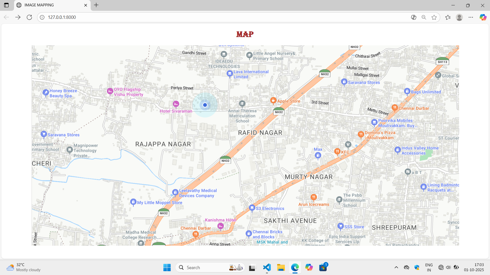
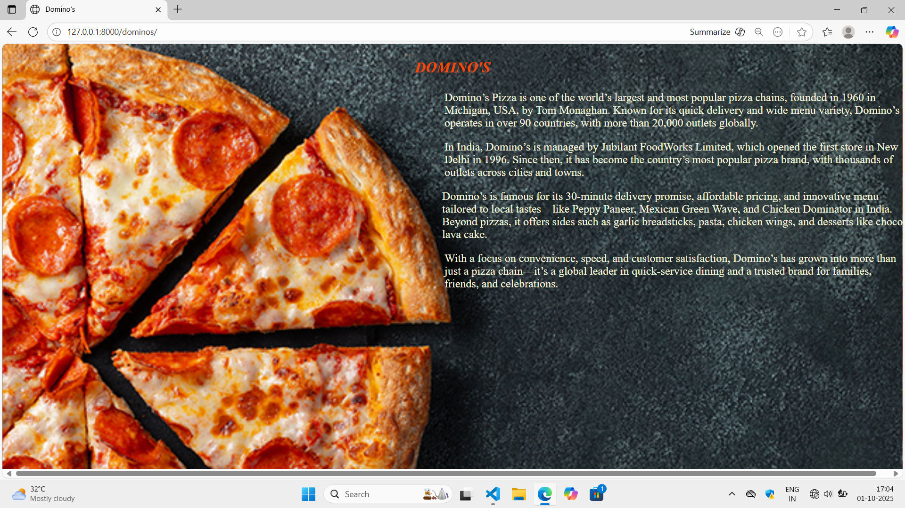
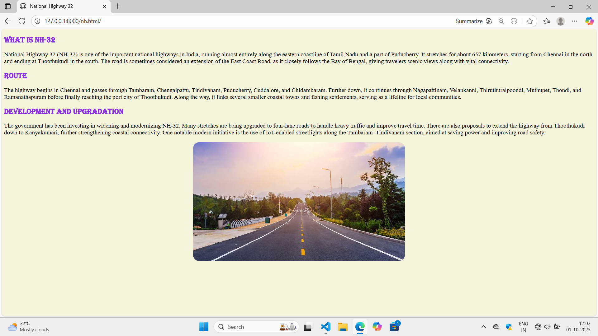
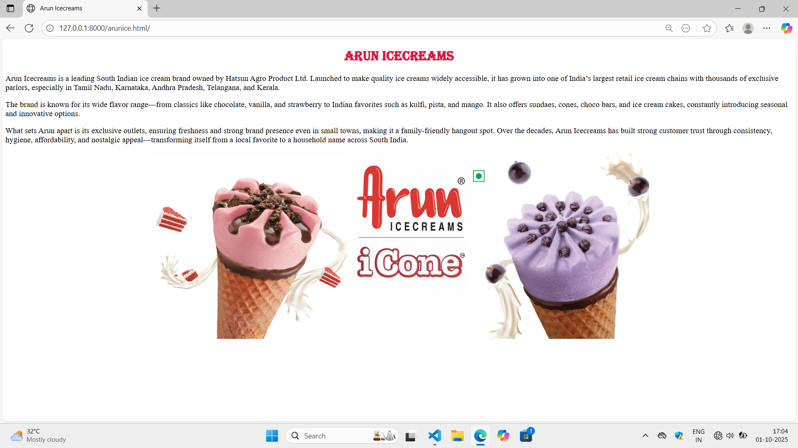
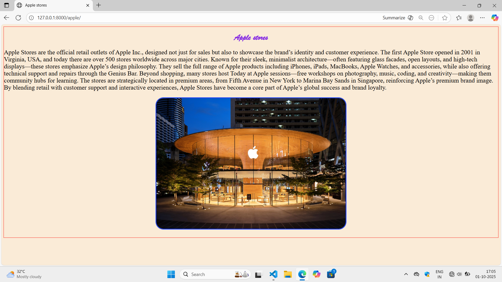

# Ex04 Places Around Me
# Date:30.09.2025
# AIM
To develop a website to display details about the places around my house.

# DESIGN STEPS
## STEP 1
Create a Django admin interface.

## STEP 2
Download your city map from Google.

## STEP 3
Using <map> tag name the map.

## STEP 4
Create clickable regions in the image using <area> tag.

## STEP 5
Write HTML programs for all the regions identified.

## STEP 6
Execute the programs and publish them.

# CODE
```
imgmap.html

<!DOCTYPE html>
<html lang="en">
<head>
    <meta charset="UTF-8">
    <meta name="viewport" content="width=device-width, initial-scale=1.0">
    <title>IMAGE MAPPING</title>
</head>
<body>
    
    <h1 style="font-family: algerian;color: brown;text-align: center;">MAP</h1>
    <center></center>
    <map name="myplace">
        <area shape="rect" coords="700,400,759,449" href="" title="NH32">
        <area shape="rect" coords="946,250,983,269" href="" title="NH32">
        <area shape="rect" coords="1100,50,1165,119" href="" title="NH32">
        <area shape="rect" coords="500,600,536,664" href="" title="NH32">
        <area shape="rect" coords="1060,600,1140,620" href="" title="Arun icecreams">
        <area shape="rect" coords="1250,300,1303,351" href="" title="Domino's">
        <area shape="rect" coords="1214,141,1314,144" href="" title="Saravana stores">
        <area shape="rect" coords="938,210,996,220" href="" title="Apple stores">
        
    </map>
</body>
</html>

dominos.html

<!DOCTYPE html>
<html lang="en">
<head>
    <meta charset="UTF-8">
    <meta name="viewport" content="width=device-width, initial-scale=1.0">
    <title>Domino's</title>
    <style>
        body{
            background-image: url("https://blog.siegfriedgroup.com/wp-content/uploads/2020/01/Dominos-3x2-1.jpg");
            background-size: cover;
        }
    </style>
</head>

<body style="font-family: 'Times New Roman', Times, serif;">
    <b><i><p style=" font-size :xx-large;color: orangered;text-align: center;">DOMINO'S</p></i></b>
    <p style="width: 1000px;position: relative; left: 930px;font-size: x-large;color: beige;">Domino’s Pizza is one of the world’s largest and most popular pizza chains, founded in 1960 in Michigan, USA, by Tom Monaghan. Known for its quick delivery and wide menu variety, Domino’s operates in over 90 countries, with more than 20,000 outlets globally.</p>

<p style="width: 1000px;position: relative; left: 930px;font-size: x-large;color: beige;">In India, Domino’s is managed by Jubilant FoodWorks Limited, which opened the first store in New Delhi in 1996. Since then, it has become the country’s most popular pizza brand, with thousands of outlets across cities and towns.</p>

<p style="width: 1000px;position: relative; left: 925px;font-size: x-large;color: beige;">Domino’s is famous for its 30-minute delivery promise, affordable pricing, and innovative menu tailored to local tastes—like Peppy Paneer, Mexican Green Wave, and Chicken Dominator in India. Beyond pizzas, it offers sides such as garlic breadsticks, pasta, chicken wings, and desserts like choco lava cake.</p>

<p style="width: 980px;position: relative; left: 930px;font-size: x-large;color: beige;">With a focus on convenience, speed, and customer satisfaction, Domino’s has grown into more than just a pizza chain—it’s a global leader in quick-service dining and a trusted brand for families, friends, and celebrations.</p>
</body>
</html>

nh.html

<!DOCTYPE html>
<html lang="en">
<head>
    <meta charset="UTF-8">
    <meta name="viewport" content="width=device-width, initial-scale=1.0">
    <title>National Highway 32</title>
</head>
<body bgcolor="beige">
    
    <h2 style="color: blueviolet;font-family: algerian;">What is NH-32</h2>
    <p style="font-family: 'Times New Roman', Times, serif;font-size: larger;">National Highway 32 (NH-32) is one of the important national highways in India, running almost entirely along the eastern coastline of Tamil Nadu and a part of Puducherry. It stretches for about 657 kilometers, starting from Chennai in the north and ending at Thoothukudi in the south. The road is sometimes considered an extension of the East Coast Road, as it closely follows the Bay of Bengal, giving travelers scenic views along with vital connectivity.</p>
    <h2 style="color: blueviolet;font-family: algerian;">Route</h2>
    <p style="font-family: 'Times New Roman', Times, serif;font-size: larger;">The highway begins in Chennai and passes through Tambaram, Chengalpattu, Tindivanam, Puducherry, Cuddalore, and Chidambaram. Further down, it continues through Nagapattinam, Velankanni, Thiruthuraipoondi, Muthupet, Thondi, and Ramanathapuram before finally reaching the port city of Thoothukudi. Along the way, it links several smaller coastal towns and fishing settlements, serving as a lifeline for local communities.</p>
    <h2 style="color: blueviolet;font-family: algerian;">Development and upgradation</h2>
    <p style="font-family: 'Times New Roman', Times, serif;font-size: larger;">
        The government has been investing in widening and modernizing NH-32. Many stretches are being upgraded to four-lane roads to handle heavy traffic and improve travel time. There are also proposals to extend the highway from Thoothukudi down to Kanyakumari, further strengthening coastal connectivity. One notable modern initiative is the use of IoT-enabled streetlights along the Tambaram–Tindivanam section, aimed at saving power and improving road safety.
    </p>
   <center>  </center>
</body>
</html>

saravana.html

<!DOCTYPE html>
<html lang="en">
<head>
    <meta charset="UTF-8">
    <meta name="viewport" content="width=device-width, initial-scale=1.0">
    <title>Saravana stores</title>
</head>
<body style="border: 1px solid black;">
    
    <center></center>
    
    <p style="font-size: x-large; text-align: justify;">Saravana Stores is a famous retail chain based in Chennai, Tamil Nadu, founded in 1969 by S. Selvarathinam Nadar and his brothers. Known as one of South India’s biggest “one-stop shopping” destinations, it offers a vast range of products including textiles, garments, jewellery, electronics, home appliances, kitchenware, furniture, and groceries. The brand caters mainly to middle-income customers with its strategy of providing a wide variety of goods at affordable prices, which has made it hugely popular. Starting as a small textile shop on Ranganathan Street in T. Nagar, it has now grown into massive multi-storied showrooms across Chennai and other Tamil Nadu cities like Madurai, Coimbatore, and Tirunelveli. Landmark outlets include “The Legend” at Padi and “The Crown Mall” on OMR, while its “Elite” jewellery showrooms target premium buyers. Saravana Stores employs thousands of people and generates revenues in the thousands of crores, making it a retail giant in the region. In recent years, it has also expanded into e-commerce with its SupersSmart app to compete with online players, though it continues to face challenges like heavy crowding, high operating costs, and competition from national and online retailers. Despite these, it remains a household name in Tamil Nadu, symbolizing affordability, variety, and large-scale retail shopping.</p>

    <center><h1></h1></center>
</body>
</html>

apple.html

<!DOCTYPE html>
<html lang="en">
<head>
    <meta charset="UTF-8">
    <meta name="viewport" content="width=device-width, initial-scale=1.0">
    <title>Apple stores</title>
</head>
<body style="background-color: antiquewhite;border: 2px solid salmon;">
    
    <h1 style="font-family: brush script mt; color: blueviolet; text-align: center;" > Apple stores</h1>
    <p style="font-size: x-large;">Apple Stores are the official retail outlets of Apple Inc., designed not just for sales but also to showcase the brand’s identity and customer experience. The first Apple Store opened in 2001 in Virginia, USA, and today there are over 500 stores worldwide across major cities. Known for their sleek, minimalist architecture—often featuring glass facades, open layouts, and high-tech displays—these stores emphasize Apple’s design philosophy. They sell the full range of Apple products including iPhones, iPads, MacBooks, Apple Watches, and accessories, while also offering technical support and repairs through the Genius Bar. Beyond shopping, many stores host Today at Apple sessions—free workshops on photography, music, coding, and creativity—making them community hubs for learning. The stores are strategically located in premium areas, from Fifth Avenue in New York to Marina Bay Sands in Singapore, reinforcing Apple’s premium brand image. By blending retail with customer support and interactive experiences, Apple Stores have become a core part of Apple’s global success and brand loyalty.</p>
    <center><h1></h1></center>
</body>
</html>

arunice.html

<!DOCTYPE html>
<html lang="en">
<head>
    <meta charset="UTF-8">
    <meta name="viewport" content="width=device-width, initial-scale=1.0">
    <title>Arun Icecreams</title>
</head>
<body>
    
    <h1 style="font-family: algerian;color: crimson;text-align: center;">Arun Icecreams</h1>
   <p style="font-family: 'Times New Roman', Times, serif;font-size: larger;"> Arun Icecreams is a leading South Indian ice cream brand owned by Hatsun Agro Product Ltd. Launched to make quality ice creams widely accessible, it has grown into one of India’s largest retail ice cream chains with thousands of exclusive parlors, especially in Tamil Nadu, Karnataka, Andhra Pradesh, Telangana, and Kerala.</p>

<p style="font-family: 'Times New Roman', Times, serif;font-size: larger;">The brand is known for its wide flavor range—from classics like chocolate, vanilla, and strawberry to Indian favorites such as kulfi, pista, and mango. It also offers sundaes, cones, choco bars, and ice cream cakes, constantly introducing seasonal and innovative options.</p>

<p style="font-family: 'Times New Roman', Times, serif;font-size: larger;">What sets Arun apart is its exclusive outlets, ensuring freshness and strong brand presence even in small towns, making it a family-friendly hangout spot. Over the decades, Arun Icecreams has built strong customer trust through consistency, hygiene, affordability, and nostalgic appeal—transforming itself from a local favorite to a household name across South India.</p>
<center></center>
</body>
</html>

views.py

from django.shortcuts import render
def map(request):
    return render(request,'imgmap.html')

def highway(request):
    return render(request,'nh.html')

def icecream(request):
    return render(request,'arunice.html')

def dominos(request):
    return render(request, 'dominos.html')

def saravana(request):
    return render(request, 'saravana.html')

def apple(request):
    return render(request, 'apple.html')
# Create your views here.

urls.py

from django.contrib import admin
from django.urls import path
from imgmap_app import views

urlpatterns = [
    path('admin/', admin.site.urls),
    path('', views.map),
    path('nh.html/', views.highway, name='highway'),
    path('arunice.html/', views.icecream, name='icecream'),
    path('dominos/', views.dominos, name='dominos'),
    path('sstores', views.saravana, name='saravana'),
    path('apple/', views.apple, name='apple'),
]

```
# OUTPUT







# RESULT
The program for implementing image maps using HTML is executed successfully.
